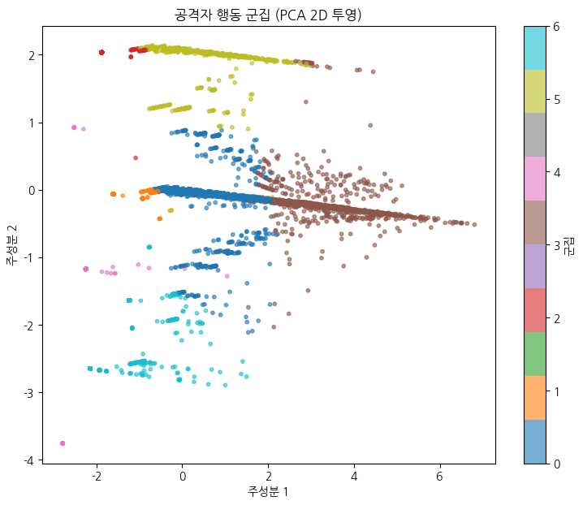

[](https://colab.research.google.com/github/njwon/home-lab-security-analyze/blob/main/notebooks/analysis.ipynb)

# 🔍 홈서버 공격 로그 비지도학습 분석

실제 홈랩(Proxmox + pfSense + Suricata)에서 28일간 수집한 약 8만 건의 IDS 경보 로그를, K-means로 **공격자 행동 유형 7개 군집**으로 자동 분류한 프로젝트입니다. (Silhouette Score 0.632)



## 목차
- [개요](#개요)
- [데이터](#데이터)
- [방법론](#방법론)
- [결과](#결과)
- [한계 및 향후 과제](#한계-및-향후-과제)
- [실행 방법](#실행-방법)
- [프로젝트 구조](#프로젝트-구조)

## 개요

기존 IDS는 시그니처 기반으로 개별 공격을 탐지하지만, "어떤 공격자가 어떤 목적을 가졌는지"는 알려주지 않습니다. 이 프로젝트는 라벨이 없는 방화벽 로그를 비지도 학습으로 묶어, 사람이 일일이 분류하지 않고도 공격자 행동 유형을 자동으로 도출하는 것을 목표로 합니다.

## 데이터

- **수집 환경**: 홈랩 pfSense 방화벽 위에서 동작하는 Suricata IDS
- **기간**: 2026-06-01 ~ 2026-06-29 (28일)
- **규모**: 약 82,918건의 경보 로그 (`alerts.log`)
- **형식**: Suricata fast.log 포맷 텍스트 (정규식으로 10개 필드 파싱)

원본 로그는 용량과 보안상 이유로 레포에 포함하지 않았습니다.
대신, 약 1000줄 정도의 샘플 데이터와 그를 가공한 샘플 CSV 파일을 넣었습니다.

## 방법론

1. **파싱**: 정규식으로 raw 로그에서 날짜, 시그니처ID, 설명, 클래스, 위험도, 프로토콜, 출발/도착 IP·포트 추출
2. **필터링**: 사설 IP 간 통신·오탐 트래픽 제거, 외부 → 내 서버 인입 공격만 추출 (82,779건)
3. **공격 유형 라벨링**: 시그니처 설명의 키워드 기반으로 스캔/평판차단/익스플로잇/악성코드/핑정찰 등으로 1차 분류
4. **피처 엔지니어링**: 출발 IP 단위로 7개 피처 집계
   | 피처 | 의미 |
   |---|---|
   | 총횟수 | 끈질긴 공격자 vs 한두 번 스친 봇 |
   | 포트종류수 | 표적형 vs 무차별 스캐너 |
   | 시그니처종류수 | 단순 수법 vs 다양한 수법 |
   | UDP비율 | UDP 기반 스캐너 분리 |
   | SCAN비율 | 정찰형 여부 |
   | 위험도 | 위험도 역변환 (4 - priority) |
   | 활동기간_분 | 단발성 vs 장기 체류 |
5. **전처리**: 로그 변환(log1p) + 표준화(StandardScaler)
6. **클러스터링**: K-means, k=3~8 실루엣 계수로 탐색 → k=7 최적 (Silhouette 0.632)

## 결과

### 군집별 요약

| 군집 | IP 수 | 유형 | 특징 |
|:---:|:---:|:---|:---|
| 0 | 3,740 | 평판차단봇(장기 체류) | 적은 횟수로 며칠간 띄엄띄엄 |
| 1 | 2,903 | 단발 스쳐간 봇 | 1회 접속 후 사라짐 |
| 2 | 872 | UDP 단발 스캐너 | UDP로 한 포트만 찍고 이탈 |
| 3 | 1,536 | 잡식 헤비 스캐너 | 포트 30종 이상 무차별 스캔, 장기 체류 |
| 4 | 105 | 노이즈·오탐 집단 | 핑·프로토콜 디코딩 오류 — 실제 공격 아님 |
| 5 | 697 | UDP 다중포트 스캐너 | UDP로 여러 포트 표적 |
| 6 | 873 | SCAN 정찰형 | ET SCAN 시그니처 위주 명시적 정찰 |

전체 공격 트래픽의 약 97%는 이미 알려진 악성 IP에 대한 평판 기반 차단(기회주의적 봇)이었으며, 표적형 공격보다는 인터넷 전역을 무차별로 훑는 트래픽이 압도적이었습니다.

### 시각화

- `results/cluster_scatter.png` — PCA 2D 투영, 군집별 색상 분리
- `results/number_of_ips_per_cluster.png` — 군집별 ip 개수 비교
- `results/attack_behavior_heatmap.png` — 군집 × 피처 상대 강도 히트맵
- `results/most_targeted_ports.png` — 가장 많이 노려진 포트 Top 15
- `results/daily_attack_trend.png` — 28일간 일별 공격 추이

## 한계 및 향후 과제

- 수집 환경 특성상 표적 공격보다 무차별 스캔이 압도적이라, 정교한 표적형 공격 패턴은 충분히 포착하지 못했습니다.
- Cloudflare 경유 트래픽은 출발 IP가 가려지므로 별도 처리가 필요합니다.
- 향후 Isolation Forest 등 이상탐지 모델을 결합해 신종 공격 IP를 탐지하는 방향으로 확장할 수 있습니다.

## 실행 방법

```bash
git clone https://github.com/njwon/home-lab-security-analyze.git
cd home-lab-security-analyze
pip install -r requirements.txt
```

또는 위의 **Open In Colab** 배지를 클릭해 바로 실행할 수 있습니다. 노트북 안에서 `gdown`으로 샘플 데이터를 자동으로 받아옵니다.

## 프로젝트 구조

```
├── README.md
├── requirements.txt
├── notebooks/
│   └── analysis.ipynb
├── data/
│   └── README.md          # 데이터 출처 설명 (원본 미포함)
└── results/
    ├── cluster_scatter.png
    ├── silhouette_by_k.png
    ├── cluster_heatmap.png
    ├── top_ports.png
    └── daily_trend.png
```

## License

MIT
